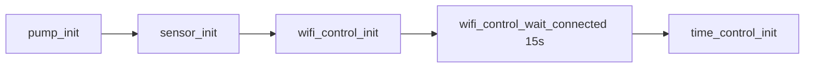

# HomeApp

ESP32-S3 firmware (ESP-IDF 5.5.5 + FreeRTOS) for a home environment monitoring device with PWM-controlled pump.

The board periodically reads and prints environmental data: temperature / humidity / pressure, air quality (PM1.0 / PM2.5 / PM10), and CO₂ concentration.

| Supported Targets | ESP32-S3 |
| ----------------- | -------- |

## Features

- **PWM-controlled pump** — LEDC 5 kHz, 10-bit duty, GPIO4.
- **Environment sensor (AHT20 + BMP280)** — temperature (°C), relative humidity (%RH), pressure (hPa) on the shared I2C bus.
- **Particulate matter sensor (PMS7003)** — PM1.0 / PM2.5 / PM10 (µg/m³) over UART, passive mode (polled periodically).
- **CO₂ sensor (SCD40)** — CO₂ (ppm), temperature, humidity on the shared I2C bus; a sensor hardware fault does **not** block the other sensors.
- **WiFi STA** — connects using Kconfig settings, auto-reconnects.
- **SNTP time sync** — ICT timezone (UTC+7).
- **ST7735 1.8" LCD (128x160)** — color display with a polished UI: large live clock, date, and per-sensor rows with 16x16 icons (thermometer, drop, gauge, cloud, particles). CO₂ value/icon is color-coded by level (green/yellow/red). Runs on SPI2 (SCLK=GPIO12, MOSI=GPIO11, CS=GPIO10, DC=GPIO9, RST=GPIO8, BL=GPIO7 — configurable in `screen_control.c`).

> [!NOTE]
> All sensor drivers are **hand-written** (no managed components), each placed in its own module folder.

## Pin map

| Function | GPIO | Notes |
| -------- | ---- | ----- |
| Pump PWM | GPIO4 | LEDC, 5 kHz, 10-bit duty |
| I2C SDA (shared) | GPIO21 | AHT20, BMP280, SCD40 |
| I2C SCL (shared) | GPIO20 | AHT20, BMP280, SCD40 |
| UART1 TX → PMS7003 RX | GPIO17 | 9600 8N1 |
| UART1 RX ← PMS7003 TX | GPIO18 | 9600 8N1 |

### I2C addresses

| Device | Address |
| ------ | ------- |
| AHT20 | 0x38 |
| BMP280 | 0x77 |
| SCD40 | 0x62 |

## Project structure

```
HomeApp
├── CMakeLists.txt              # EXTRA_COMPONENT_DIRS registering app/* modules
├── sdkconfig.defaults
├── main/
│   ├── main.c                  # app_main: pump → sensor → wifi → time
│   └── CMakeLists.txt
└── app/
    ├── common/
    │   ├── debug.h             # APP_OK/APP_ERROR, ASSERT
    │   ├── commons.h           # task_msg_t, sensor message types
    │   ├── task_define.h       # task stack size / priority
    │   └── i2c_bus/            # Shared I2C bus (singleton)
    ├── pump_control/           # PWM pump control
    ├── sensor_control/
    │   ├── sensor_control.c    # Periodic sensor-read task (20 s)
    │   ├── env_sensor/         # AHT20 + BMP280 driver (hand-written)
    │   ├── pms7003/            # PMS7003 driver (hand-written)
    │   └── scd40/              # SCD40 driver (hand-written)
    ├── screen/                 # ST7735 128x160 LCD UI (icons + clock)
    └── network/
        ├── wifi_control/       # WiFi STA + reconnect
        └── time_control/       # SNTP, TZ ICT-7
```

### Boot flow (`main/main.c`)



After boot, `sensor_task` reads the sensors every 20 s via `esp_timer` + a message queue:

| Message | Type | Data |
| ------- | ---- | ---- |
| `TASK_MSG_TYPE_SENSOR_READ` | 0x01 | AHT20 + BMP280 |
| `TASK_MSG_TYPE_PMS_READ` | 0x02 | PMS7003 |
| `TASK_MSG_TYPE_SCD40_READ` | 0x03 | SCD40 |

## Configuration

WiFi and the SNTP server are configured through `menuconfig`:

```bash
idf.py menuconfig
```

- **WiFi Configuration** → `NETWORK_WIFI_SSID`, `NETWORK_WIFI_PASSWORD`, `NETWORK_WIFI_MAXIMUM_RETRY`
- **Network Configuration** (time_control) → `NETWORK_SNTP_SERVER` (default `pool.ntp.org`)

## Build & Flash

Requires: ESP-IDF 5.5.5 (or compatible), target `esp32s3`.

```bash
idf.py set-target esp32s3
idf.py build
idf.py -p PORT flash monitor
```

Exit monitor: `Ctrl + ]`.

> [!NOTE]
> When using the ESP-IDF VS Code extension, make sure the active project is set to **HomeApp** before building/flashing.

## Sample output

```
I (…) sensor_control: Trigger SCD40 periodic measurement
I (…) sensor_control: Read sensor data
25.40°C  55.20%RH  1013.25hPa
PMS7003: PM1.0=12 ug/m3, PM2.5=18 ug/m3, PM10=25 ug/m3
```

## Known issues & gotchas

- `i2c_master_transmit` returning `259` (`0x103` = `ESP_ERR_INVALID_STATE`) is usually caused by a NACK from the slave (bad wiring / hardware fault).
- The SCD40 needs ~1 s of power before it ACKs commands; the first measurement is ready ~5 s after `start_periodic`.
- If the SCD40 reports error code `0x8006` (datasheet malfunction code) on every write/read → hardware fault, power-cycle the module or replace it.

## License

See [LICENSE](LICENSE) (if present). Defaults to [CC0-1.0](https://creativecommons.org/publicdomain/zero/1.0/) like the ESP-IDF template.
